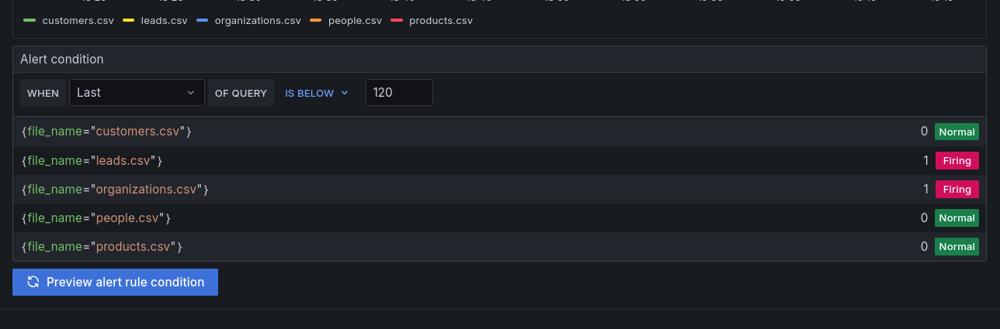
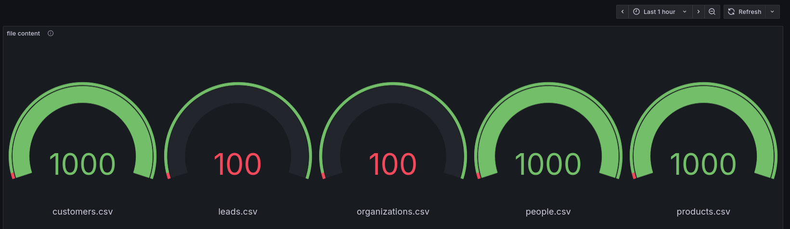
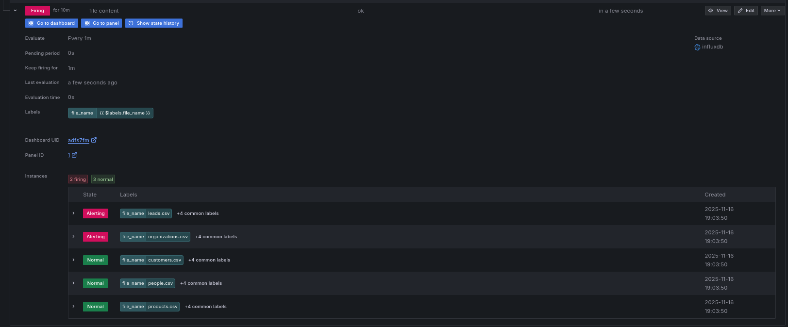
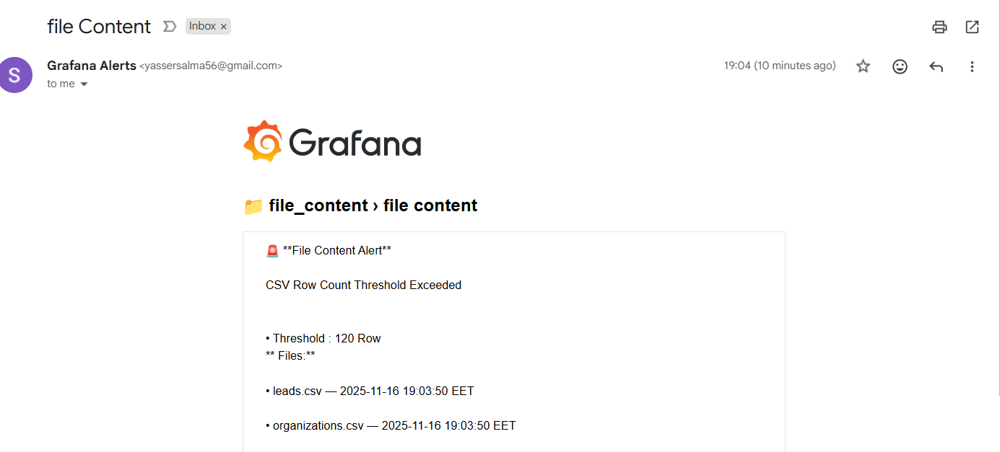

## A. Write the script and test it

1. create venv

```bash
python3 -m venv .venv
```

2. source venv and install needed packages

```bash
 source .venv/bin/activate
  pip install pandas pyyaml
```

3. Run script

```bash
python file_content.py
```

## B. Add script in telegraf config

1. set the suitable permission for the csv files dir

```bash
sudo chmod a+rx /files
# give each file read permission
sudo chmod 644 -R /files
```

2. verify the script run correctlly

```bash
# path to bin file in venv to skip sourcing
./.venv/bin/python3 ./files_content.py
```

3. copy the script dir in `/files_content` dir

```bash
sudo cp -r  ./files_content/  /files_content
chmod a+rx -R /files_content
```

4. add script configration in `/etc/telegraf/telegraf.d/files_content.conf`

```bash
sudo vim /etc/telegraf/telegraf.d/files_content.conf
```

```sh
[[inputs.exec]]
  commands = ["/files_content/.venv/bin/python3 /files_content/files_content.py"]
  timeout = "1m"
  data_format = "influx"
```

5. restart telegraf to read new conf

```bash
sudo systemctl restart telegraf
```

## C. grafana query

```sql
from(bucket: "vm_metrics")
|> range(start: -1h)
|> filter(fn: (r) => r["_measurement"] == "file_content_check")
|> filter(fn: (r) => r["_field"] == "rows")   // only numeric values
|> keep(columns: ["_time", "_value", "file_name"])
```

- alert is firing when num of rows is below 120 row
  

# Verification

- Dashboard
  
- Alert firing
  
- Alert email
  
