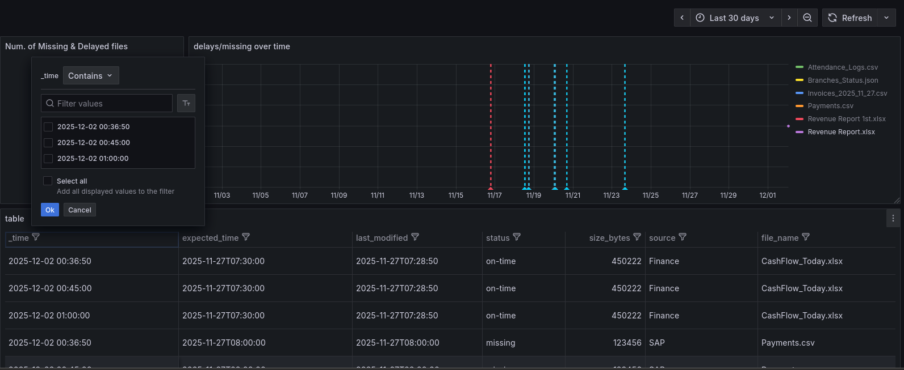
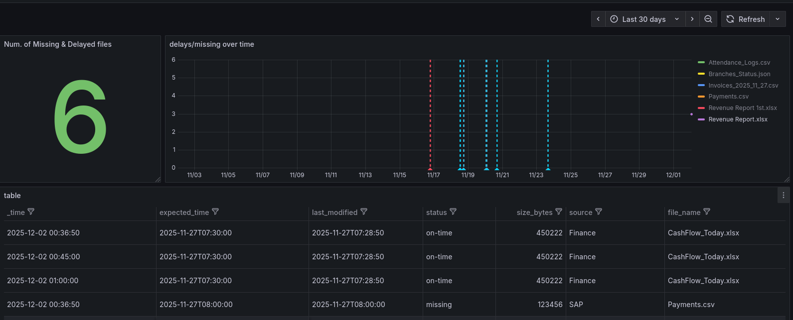

# Script running in `/usr/local/bin/read_files_json.sh`

```bash

#!/bin/bash

# Get today's date
TODAY=$(date +"%Y_%m_%d")
# Build the filename
FILE="/data/file1_${TODAY}.json"

# If file does not exist, exit quietly
if [[ ! -f "$FILE" ]]; then
  echo "[]"
  exit 0
fi

# Output JSON content
jq '.' "$FILE"
```

---

# telegraf conf

```bash
[[inputs.exec]]
  commands = ["/usr/local/bin/read_files_json.sh"]
  timeout = "10s"
  data_format = "json"
  json_query = ""
  tag_keys = ["source", "file_name", "status", "expected_time", "last_modified"]
  fieldinclude = ["size_bytes"]
  name_override = "file_status"
  interval = "15m"
```

---

# Grafana Queries

1. Table Panel — List all files with their status, last modified, and size

```sql
from(bucket: "vm_metrics")
  |> range(start: v.timeRangeStart, stop: v.timeRangeStop)
  |> filter(fn: (r) => r._measurement == "file_status")
  |> group()
  |> filter(fn: (r) => r._field == "size_bytes")
  |> map(fn: (r) => ({
    source: r.source,
    file_name: r.file_name,
    expected_time: r.expected_time,
    last_modified: r.last_modified,
    status: r.status,
    size_bytes: r._value,
    _time: r._time
  }))

```

2. Gauge Panel — Count of delayed or missing files

```sql
from(bucket: "vm_metrics")
  |> range(start: -15m)  // last update
  |> filter(fn: (r) => r._measurement == "file_status")
  |> filter(fn: (r) => r.status == "late" or r.status == "missing")
  |> group()                                // combine all files
  |> count(column: "_value")                // count number of delayed/missing files

```

3. Time Series Panel — Track delays/missing over time

```sql
from(bucket: "vm_metrics")
  |> range(start: -30d)                     // last month
  |> filter(fn: (r) => r._measurement == "file_status")
  |> filter(fn: (r) => r.status == "late" or r.status == "missing")
  |> keep(columns: ["file_name", "_value", "_time"])
  |> aggregateWindow(every: 1d, fn: count, createEmpty: false)


```

# Dashboard




